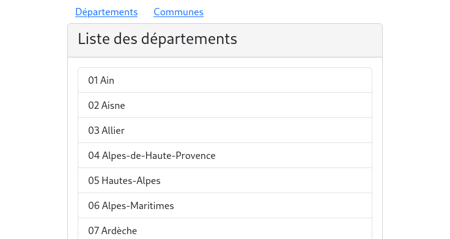

# NgbrxPaginator

You have an application that uses ngrx to store your data.
NgbrxPaginator gives you a really easy way to paginate your data with filters.

This package is in **BETA** and is developped with angular@16, ngrx@16 and ng-bootstrap@15.

The code is rather simple and if you want to join, you are more than welcome.

**This package does not deal with backend pagination.**


### Demo https://collorg.github.io/ngbrx-paginator-demo

### Installation

```bash
npm i ngbrx-paginator
```

ngbrx-paginator depends on [ngrx](https://ngrx.io/) and [ng-bootstrap](https://ng-bootstrap.github.io).

## Usage

The following example is extracted from the [departement](./projects/test-paginator/src/app/departement) module of the test application.

Suppose you have a `departement` [sic] module that has a slice of your store containing all the departments of France. The module provides a `departements` component that displays an unpaginated list of the departments:

departements.component.ts
```ts
import { Component } from '@angular/core';
import { Observable } from 'rxjs';
import { Departement } from '../departement.model';
import { Store } from '@ngrx/store';
import * as fromStore from '../departement.reducer';

@Component({
  selector: 'app-departements',
  templateUrl: './departements.component.html',
  styleUrls: ['./departements.component.css']
})
export class DepartementsComponent {
  collection$: Observable<Departement[]> = this.store.select(fromStore.selectAll);

  constructor(
    private store: Store<fromStore.State>
  ) { }

}
```

departements.component.html
```html
<div class="card">
  <div class="card-header sticky-top">
    <h3 clas="row">
      <span class="col-md">Liste des départements</span>
    </h3>
  </div>
  <div class="card-body">
    <div class="list-group">
      <div class="list-group-item" *ngFor="let item of collection$ | async">
        {{ item.code }} {{ item.nom }}
      </div>
    </div>
  </div>
</div>
```



First, add the `NgbrxPaginatorModule` to your [departement.module.ts](./projects/test-paginator/src/app/departement/departement.module.ts) dependencies:

```ts
import * as fromDepartement from './departement.reducer';
import { NgbrxPaginatorModule } from 'ngbrx-paginator';

@NgModule({
  [...]
  imports: [
    [...]
    NgbrxPaginatorModule.forFeature({
      'Departement/Pagination': // The name of the paginator must be unique for the application.
      {
        allDataSelector: fromDepartement.selectAll, // @ngrx selector returning all the data set

        // Optional
        filters: { // You can provide more than one filter by paginator.
          'Nom': { filter: fromDepartement.byName },
          'Code': {
            filter: fromDepartement.byCode,
            inactivate: true // Optional: not displayed when the page is loaded for the first time.
          },
          'Régions/COM': {
            filter: fromDepartement.byRegion,
            values: fromDepartement.selectRegions // Optional: provides the select values
          }
        },
        pageSizeOptions: [10, 20, 30] // Defaults to [5, 10, 25, 100]
      } 
    }),
    [...]
  ],
```

The object provided to the forFeature static method discribes the paginators for this module.
Each paginator is an object identified by a unique name in the application with the following properties:
    
* `allDataSelector`: the ngrx selector that returns the observable of your data set;
* `filters?`: (optional) an object of type `{ [key: string]: { filter, values?, inactivate? } }`.

  Each filter is identified by a key which will be used as a placeholder for the input or the default value for the select. To each key is associated an object with the following properties:

  * `filter`: a filter function that takes two parameters `(items: Data[], query: string)` and returns `Data[]`;
  * `values`: (optional) a MemoizedSelector. If provided, a HTML select element is displayed with the values instead of the input.
  * `inactivate`: (optional) boolean. If set to true the filter is inactivated when the paginator is loaded for the first time.
* `pageSizeOptions?`: (optional) defaults to [5, 10, 25, 100].

You have done the most important part of the job. Now, in your component class, add the attribute `key` to specify the name of the paginator, and use `NgbrxPaginationService` to paginate/filter your collection:

```ts
import { Component } from '@angular/core';
import { Observable } from 'rxjs';
import { Departement } from '../departement.model';
import { NgbrxPaginatorService } from 'ngbrx-paginator';

@Component({
  selector: 'app-departements',
  templateUrl: './departements.component.html',
  styleUrls: ['./departements.component.css']
})
export class DepartementsComponent {
  key = 'Departement/Pagination'; // same as in NgbrxPaginatorModules.forFeature
  // replace: collection$: Observable<Departement[]> = this.fromDepartement.selectAll; with:
  collection$: Observable<Departement[]> = this.paginationService.getPageItems$<Departement>(this.key);

  constructor(
    // inject NgbrxPaginatorService
    private paginationService: NgbrxPaginatorService
  ) { }

}
```

Finally, add the `ngbrx-paginator` component and the optional `ngbrx-paginator-filter-desc` component in your [template](./projects/test-paginator/src/app/departement/departements/departements.component.html):

```html
<div class="card">
  <div class="card-header sticky-top">
    <h3>
      Liste des départements
    <!-- add (optional) --> <ngbrx-paginator-filter-desc class="right" [key]="key"></ngbrx-paginator-filter-desc>
    </h3>
    <!-- add --> <ngbrx-paginator [key]="key"></ngbrx-paginator>
  </div>
  <div class="card-body">
    <div class="list-group">
      <div class="list-group-item" *ngFor="let item of collection$ | async">
        {{ item.code }} {{ item.nom }}
      </div>
    </div>
  </div>
</div>
```

Voilà ! You now have a paginated list of `departements` with filters:

