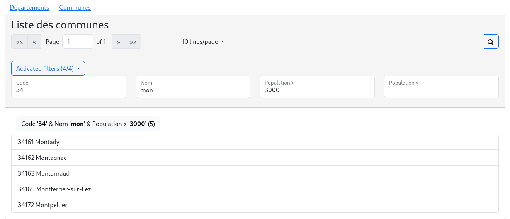

# NgbrxPaginator

You have an application that uses ngrx to store your data.
NgbrxPaginator gives you a really easy way to paginate your data with filters.

This package is in **BETA** and is developped with angular@16, ngrx@16 and ng-bootstrap@15.

The code is rather simple and if you want to join, you are more than welcome.

**This package does not deal with backend pagination.**





### Demo https://collorg.github.io/ngbrx-paginator-demo

### Installation

```bash
npm i ngbrx-paginator
```

ngbrx-paginator depends on [ngrx](https://ngrx.io/) and [ng-bootstrap](https://ng-bootstrap.github.io).

## Usage

The sample code is extracted from the [departement](./projects/test-paginator/src/app/departement) module of the test application.

Add the `NgbrxPaginatorModule` in your [departement.module.ts](./projects/test-paginator/src/app/departement/departement.module.ts) dependencies:

```ts
import * as fromDepartement from './departement.reducer';
import { NgbrxPaginatorModule } from 'ngbrx-paginator';

@NgModule({
  [...]
  imports: [
    [...]
    NgbrxPaginatorModule.forFeature({
      'Departement/Pagination': // The name of the paginator must be unique for the application.
      {
        allDataSelector: fromDepartement.selectAll, // @ngrx selector returning all the data set

        // Optional
        filters: { // You can provide more than one filter by paginator.
          'Nom': { filter: fromDepartement.byName },
          'Code': { filter: fromDepartement.byCode },
          'Régions/COM': {
            filter: fromDepartement.byRegion,
            values: fromDepartement.selectRegions // Optional: provide select values
          }
        },
        pageSizeOptions: [10, 20, 30] // Defaults to [5, 10, 25, 100]
      } 
    }),
    [...]
  ],
```

in your component class add the attributes `key` and , and use `NgbrxPaginationService` to paginate/filter your collection:

```ts
import { Component } from '@angular/core';
import { Observable } from 'rxjs';
import { Departement } from '../departement.model';
import { NgbrxPaginatorService } from 'ngbrx-paginator';

@Component({
  selector: 'app-departements',
  templateUrl: './departements.component.html',
  styleUrls: ['./departements.component.css']
})
export class DepartementsComponent {
  key = 'Departement/Pagination'; // same as in NgbrxPaginatorModules.forFeature
  // replace: collection$: Observable<Departement[]> = this.fromDepartement.selectAll; with:
  collection$: Observable<Departement[]> = this.paginationService.getPageItems$<Departement>(this.key);

  constructor(
    // inject NgbrxPaginatorService
    private paginationService: NgbrxPaginatorService
  ) { }

}
```

Finally, add the `ngbrx-paginator` component and the optional `ngbrx-paginator-filter-desc` component in your [template](./projects/test-paginator/src/app/departement/departements/departements.component.html):

```html
<div class="card">
  <div class="card-header sticky-top">
    <h3>
      Liste des départements
    </h3>
    <!-- ngbrx-paginator provides the pagination with the optional filters -->
    <ngbrx-paginator [key]="key"></ngbrx-paginator>
  </div>
  <div class="card-body">
    <!-- optional --> <ngbrx-paginator-filter-desc [key]="key"></ngbrx-paginator-filter-desc>
    <div class="list-group">
      <div class="list-group-item" *ngFor="let item of collection$ | async">
        {{ item.code }} {{ item.nom }}
      </div>
    </div>
  </div>
</div>
```

