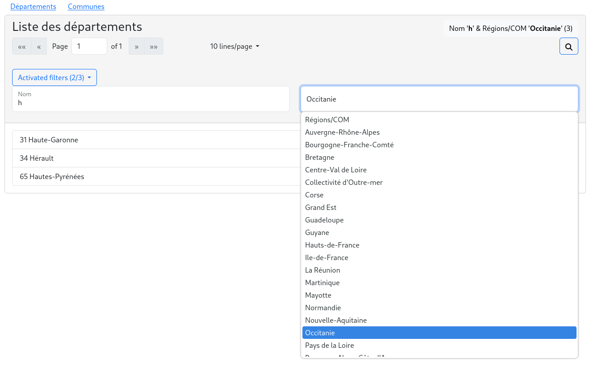

# NgbrxPaginator (BETA)

You have an application that uses ngrx to store your data.
NgbrxPaginator provides you easy reactive pagination with multiple filters that can be combined.


This package does not deal with backend pagination.

### Demo

https://collorg.github.io/ngbrx-paginator-demo

### Installation

```bash
npm i ngbrx-paginator
```

ngbrx-paginator depends on [ngrx](https://ngrx.io/) and [ng-bootstrap](https://ng-bootstrap.github.io).

## Usage

The example code is extracted from the [departement](./projects/test-paginator/src/app/departement) module

Add the `NgbrxPaginatorModule` in your [departement.module.ts](./projects/test-paginator/src/app/departement/departement.module.ts) dependencies:

```ts
import * as fromDepartement from './departement.reducer';
import { NgbrxPaginatorModule } from 'ngbrx-paginator';

@NgModule({
  [...]
  imports: [
    [...]
    NgbrxPaginatorModule.forFeature({
      paginators: [ // you can have as many paginators as you need per module
        {
          key: 'Departement/Pagination', // must be unique for the app
          allDataSelector: fromDepartement.selectAll, // ngrx selector returning all the data set
          filters: { // Optional. You can provide more than one filter by paginator.
            'Nom': { filter: fromDepartement.byName },
            'Code': { filter: fromDepartement.byCode },
            'Régions/COM': { filter: fromDepartement.byRegion, values: fromDepartement.selectRegions }
          },
          pageSizeOptions: [10, 20, 30] // Optional. Defaults to [5, 10, 25, 100]
        }
      ]
    }),
    [...]
  ],
```

in your component class add the attributes `key` and , and use NgbrxPaginationService to filter your collection by page:

```ts
import { Component } from '@angular/core';
import { Observable } from 'rxjs';
import { Departement } from '../departement.model';
import { NgbrxPaginatorService } from 'ngbrx-paginator';

@Component({
  selector: 'app-departements',
  templateUrl: './departements.component.html',
  styleUrls: ['./departements.component.css']
})
export class DepartementsComponent {
  key = 'Departement/Pagination'; // same as in NgbrxPaginatorModules.forFeature
  collection$: Observable<Departement[]> = this.paginationService.getPageItems$<Departement>(this.key);

  constructor(
    private paginationService: NgbrxPaginatorService
  ) { }

}
```

Finally, use the `ngbrx-paginator` component and the optional `ngbrx-paginator-filter-desc` component in your [template](./projects/test-paginator/src/app/departement/departements/departements.component.html):

```html
<div class="card">
  <div class="card-header sticky-top">
    <h3>
      Liste des départements
      <div class="right">
        <small><small><ngbrx-paginator-filter-desc [key]="key"></ngbrx-paginator-filter-desc></small></small>
      </div>
    </h3>
    <ngbrx-paginator [key]="key"></ngbrx-paginator>
  </div>
  <div class="card-body">
    <div class="list-group">
      <div class="list-group-item" *ngFor="let item of collection$ | async">
        {{ item.code }} {{ item.nom }}
      </div>
    </div>
  </div>
</div>
```

`ngbrx-paginator-filter-desc`

